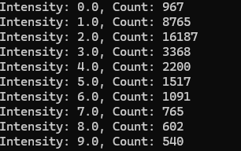
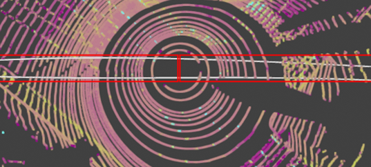
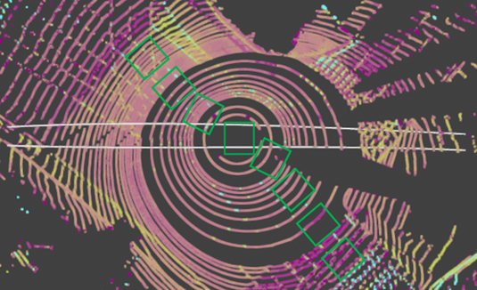
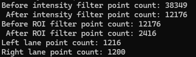

# Automobile Ego Lane Detection


### Goal

The goal of this project is to return a 3-degree polynomial fitting of the left and right ego lane. Our data is mostly top-down so we will be ignoring z coordinates and only detecting right and left ego lane lines.
```
y = coef[0] * x ** 3 + coef[1] * x ** 2 + coef[2] * x + coef[3]
```

### Data 

+ `point[:3]` are the x, y, z coordinates of each point
+ `point[3]` is the intensity value of the lidar reflection of each point
+ `point[4]` tells you which lidar beam the point came from, there are 32 lidar beams in this datset

### Environment

Please setup the environment with the dependencies listed in requirement.txt
```
conda create --name lane_test python==3.8
conda activate lane_test
pip install -r vis_requirement.txt
python data_visualize.py
```
- Use data_visualize.py to visualize the points clouds and the lane detections.
- Use lane_detection.py to generate polynomial fits of the ego lane lines. Further improvements to the lane detection pipeline can be made here.

### Approach

My approach to Ego Lane Detection is a solid basis that can be improved for complicated scenes with more curvature. My approach can get decent detections if the ego car is moving in the same general direction as the lane. My approach will struggle when the lane ahead curves significantly. This is mainly due to how my region of interest is defined which is the main improvement that could be made to my approach. My approach filters the raw point cloud data through 3 filters. An intensity filter, region of interest filter, and a left-right split filter. 

- Intensity Filter
Most points of a road will be asphalt with darker lidar intensities, lane line points would be a minority with higher intensities. This is the justification for my intensity filter. A histogram or a print out of the count distribution shows which intensities we could potentially filter out. Under the assumption that the asphalt, low intensity points would be the majority I decided to filter out the lowest intensity points.

<p style="padding-left: 50px;">
    
</p>

- Region-of-Interest Filter
Because this is ego lane detection, we should only care about the closest right lane line and left lane line. This is the basis upon which I defined my region of interest. The average lane line width in meters is around 3.5-3.8 meters in most countries, consequently the closest lane line will be within 3.5 meters to the right or left from the car, no matter what. This is the basis with which we define the region of interest to examine for ego lane lines.

<p align="center">
  
</p>
 
<p align="center">
  
</p>

- Left-Right Point Cloud Split
The car coordinate frame has x defined as forward and y defined as left. After the region of interest window filtering, I simply took all the points with positive y and defined them as the left lane line point cloud, and negative y as the right lane line point cloud. After all this filtering the number of points considered decreased by more than a magnitude of 10.

<p align="center">
  
</p>

- Polynomial Fitting to Left and Right Point Clouds
Finally, I fed my left point cloud x values and y values to np.polyfit with a degree of 3. I did the same for the right point cloud values to get my left lane line fit and right lane line fit. These are the 3rd-order polynomials that I used as my outputs. Please see visualizations below.

<p align="center">
  
</p>

